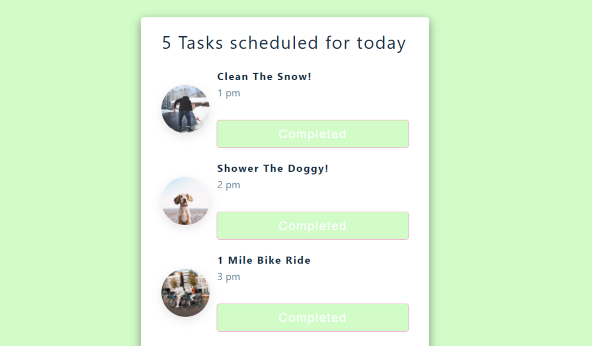

# Schedule app for future tasks/reminders. Created with React JavaScript.

Modern browser app written in React Javascript
The app allows you to create a planner that will schedule your tasks.

# Screenshot

# Live Link

[DEMO-LINK](https://61f54fd559dcbf78f375f123--quirky-agnesi-12cdd5.netlify.app/)

## Built With

- HTML & SCSS
- JavaScript/ES6
- React

## Usage local server

- Clone the repo and move into the project directory
- Run "npm install"
- Run "npm run start"

## Author

👤 **Dannison Arias**

- Github: [@dannisonarias](https://github.com/dannisonarias)
- Twitter: [@AriasDannison](https://twitter.com/AriasDannison)
- Linkedin: [Dannison Arias](https://www.linkedin.com/in/dannison-arias-777919190/)

## 🤝 Contributing

Contributions, issues and feature requests are welcome!

Feel free to check the [issues page](/issues).

## Show your support

Give a ⭐️ if you like this project!

## Acknowledgments

- Microverse
- The Odin Project

## 📝 License

This project is [MIT](./license.md) licensed.
